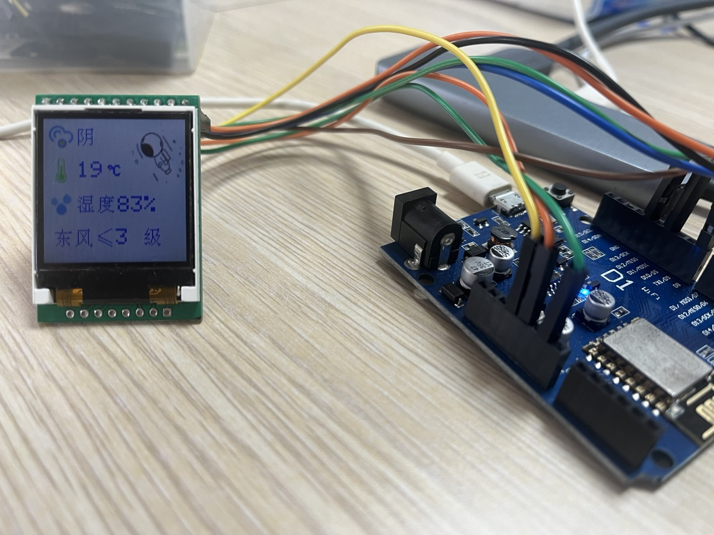

## 项目介绍

这个项目是使用VsCode+PlatformIO框架与Wemos+TFT显示屏展示天气情况的演示。    
开发板Wemos D1 是一个基于ESP8266的微控制器单片机，可以通过WiFi连接到互联网。    
TFT显示屏是一个小型的彩色液晶屏，可以用于显示图形和文本。

## 效果展示

## 特点

- 通过Wemos（ESP8266）在TFT显示屏上显示图形和文本
- 使用PlatformIO框架和VsCode进行开发
- 使用Adafruit_GFX库控制TFT显示屏
- 转化了大量中文字和Icon图片自定义显示屏

## 入门指南

要开始使用这个项目，请按照以下步骤进行操作：

1. 将存储库克隆到本地计算机。
2. 将TFT显示屏连接到开发板，并将开发板连接到计算机。 
3. 在PlatformIO中打开项目，并下载依赖。
4. 构建并上传代码到开发板。

## 依赖项

这个项目有以下依赖项：

- PlatformIO：用于构建和上传代码的开发平台。
- Adafruit_GFX：用于控制TFT显示屏的库。

## 天气数据

本人使用的数据来自高德的API，请按照以下步骤进行操作：

1. 登录高德开发者平台，创建一个应用，获取应用的Key。
2. Key填入`src/Setting.h`文件中的`API_KEY`变量。
3. 修改`src/Setting.h`文件中的`POST_CODE`变量为你所在城市的邮政编码。

## 贡献

欢迎对这个项目进行贡献。如果您发现任何问题或有任何建议，请在GitHub存储库上打开一个问题或提交一个拉取请求。

## 许可证

本项目基于MIT许可证。有关更多信息，请参阅[LICENSE](./LICENSE)文件。

## Project Introduction
This project is a demonstration of using VsCode+PlatformIO framework with Wemos TFT display to show weather conditions. Wemos TFT display is a small color LCD screen that can be used to display graphics and text.
## Features
- Display graphics and text on TFT display using Wemos (ESP8266)
- Development with PlatformIO framework and VsCode
- Control TFT display with Adafruit_GFX library
- Customized display of a large number of Chinese characters and icon images
## Getting Started
To start using this project, follow these steps:
1. Clone the repository to your local computer.
2. Connect the TFT display to the development board.
3. Open the project in PlatformIO.
4. Build and upload the code to the development board.
## Dependencies
This project has the following dependencies:
- PlatformIO: Development platform for building and uploading code.
- Adafruit_GFX: Library for controlling TFT display.
## Weather Data
The data used in this project is from the AMap API. Follow these steps:
1. Log in to the AMap developer platform, create an application, and obtain the application's key.
2. Fill in the key in the `API_KEY` variable in the `src/Setting.h` file.
3. Modify the `POST_CODE` variable in the `src/Setting.h` file to the postal code of your city.
## Contribution
Contributions to this project are welcome. If you find any issues or have any suggestions, please open an issue or submit a pull request on the GitHub repository.
## License
This project is licensed under the MIT License. For more information, see the [LICENSE](./LICENSE) file.